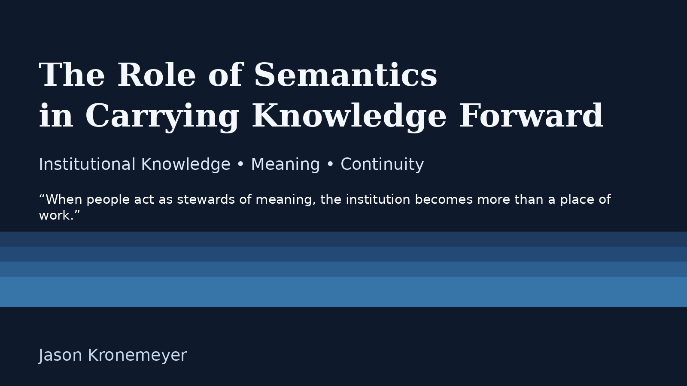

**Semantics** plays an important role in helping knowledge endure across time. In this story, semantics refers to the practice of shaping meaning in a clear and intentional way so that the purpose behind our decisions, relationships, and stories can be understood by those who come after us. When people take the ideas, decisions, and relationships that shaped their work and express them in clear and organized ways, they create a structure that others can understand long after the moment has passed. Semantics *turns scattered information into **meaning*** that can be shared, remembered, and carried forward. It allows a community to hold on to *the deeper purpose* behind its actions so that future generations can continue the story with clarity and intention.

**Institutional knowledge** lives on when the meaning behind the work is preserved with care. It continues through the stories, intentions, and relationships that shaped each choice, even as people and roles change. When a community takes time to organize this meaning in a way that others can understand, the knowledge does not fade. It becomes a steady guide for those who come next. Over time, this clarity of meaning helps shift the focus **from meeting immediate needs to supporting the deeper hopes** that people carry for themselves and their community. In this way, the work of today becomes a *bridge to tomorrow*, allowing future generations to *remember where they began*, understand why certain paths were taken, and continue building toward the lives they imagine.

This kind of continuity grows even stronger when it is shaped by the **Seven Grandfather Teachings**. **Wisdom** helps a community see the long view and understand how each decision fits into a larger story. **Love** reminds people that their work is meant to lift others and create belonging. **Respect** ensures that every voice and every memory is treated with care. **Bravery** gives people the courage to try new paths while honoring the old ones. **Honesty** keeps the record true so that future generations can trust what they inherit. **Humility** teaches that no single person holds all the answers and that knowledge is shared across many hands. **Truth** brings all of these teachings together, guiding a community to act with integrity as it moves *from needs toward aspirations*. When these teachings shape how knowledge is held and passed on, the institution becomes more than a structure. It becomes a **living story** that continues to grow with each generation.

A **community's knowledge** endures because people *choose to tend it*. They listen to the stories that came before them, they add their own understanding, and they pass it on with the hope that it will help someone else find their way. When people act as **stewards of meaning**, the institution becomes more than a place of work. It becomes a *shared journey* shaped by memory, purpose, and the desire to leave something better for those who will follow. In this kind of stewardship, semantics becomes more than a method of organizing information; it becomes a practice of honoring intention, preserving clarity, and ensuring that the heart of the work remains visible across generations.

When a community chooses to preserve meaning with intention, it strengthens its ability to grow with purpose. The stories, values, and lessons that are carried forward become a *compass for future generations*, helping them move with confidence from meeting basic needs toward fulfilling their highest aspirations. Through the lens of semantics, understood as the careful shaping of meaning across time, **institutional knowledge** becomes a living memory rather than a static record. By honoring the wisdom of those who came before and organizing knowledge in ways that can be understood by those who will follow, this living memory does more than inform decisions. Guided by the Seven Grandfather Teachings, it nurtures belonging, responsibility, and vision. In carrying meaning forward with clarity and care, we do more than maintain the past. We prepare a *future shaped by wisdom, integrity, and a shared aspiration rooted in care and responsibility*.

---
  

#### Author’s Note

*The Seven Grandfather Teachings referenced in this essay are part of a living Indigenous knowledge tradition. They are shared not as doctrine, but as guiding values that inform this reflection on meaning, continuity, and stewardship. This work is also shaped by the spirit of EUPConnect Collaborative and Merit Network Project Compass, ongoing efforts to help communities orient themselves through change by connecting infrastructure, knowledge, and aspiration. It is further informed by Kentaro Toyama’s insight that technology does not create change on its own, but amplifies existing human intent, institutional strength, and cultural values. Together, these influences frame an approach to semantics rooted in stewardship, honoring the knowledge that came before, interpreting it through lived experience, and carrying it forward with care for those who will follow.*
