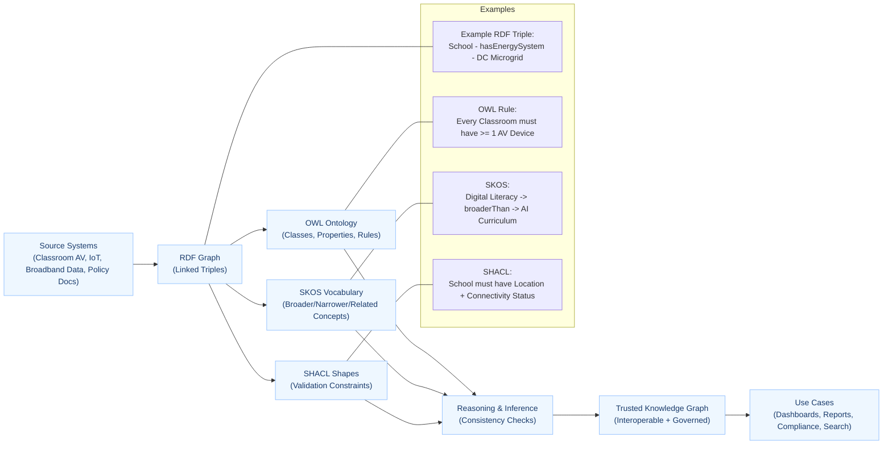

```mermaid
flowchart LR
A["Source Systems<br/>(Classroom AV, IoT, Broadband Data, Policy Docs)"]
    --> B["RDF Graph<br/>(Linked Triples)"]
    B --> C["OWL Ontology<br/>(Classes, Properties, Rules)"]
    B --> D["SKOS Vocabulary<br/>(Broader/Narrower/Related Concepts)"]
    B --> E["SHACL Shapes<br/>(Validation Constraints)"]

    C --> F["Reasoning & Inference<br/>(Consistency Checks)"]
    D --> F
    E --> F

    F --> G["Trusted Knowledge Graph<br/>(Interoperable + Governed)"]
    G --> H["Use Cases<br/>(Dashboards, Reports, Compliance, Search)"]
    
    %% Context labels
    classDef ctx fill:#eef7ff,stroke:#8bbcff,stroke-width:1px,color:#1a3b6b;
    class A,B,C,D,E,F,G,H ctx;

    %% Examples
    subgraph Examples
      X1["Example RDF Triple:<br/>School - hasEnergySystem - DC Microgrid"]
      X2["OWL Rule:<br/>Every Classroom must have >= 1 AV Device"]
      X3["SKOS:<br/>Digital Literacy -> broaderThan -> AI Curriculum"]
      X4["SHACL:<br/>School must have Location + Connectivity Status"]
    end
    B --- X1
    C --- X2
    D --- X3
    E --- X4
```
