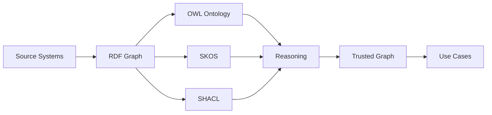

```mermaid
flowchart LR
  A[Source Systems]
  B[RDF Graph]
  C[OWL Ontology]
  D[SKOS]
  E[SHACL]
  A --> B
  B --> C
  B --> D
  B --> E
  C --> F[Reasoning]
  D --> F
  E --> F
  F --> G[Trusted Graph]
  G --> H[Use Cases]
```
